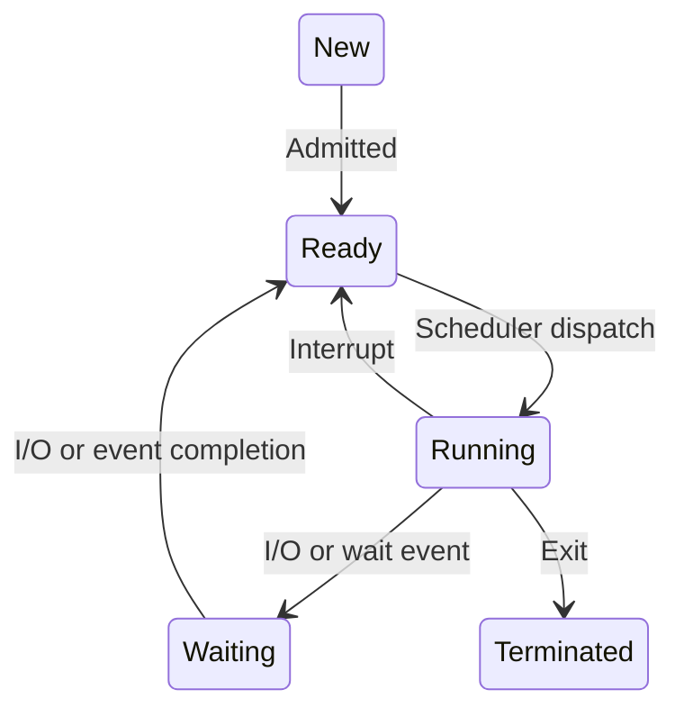

## Definition

A program that acts as an intermediary between a user and the hardware

## Goals

-   Execute user programs

-   Make solving user programs easier

-   Make the computer system convenient to use

-   Use the resources of the systems fairly and efficiently

## Components

An operating system is a:

-   **Resource allocator**: Responsible for the management of the
    computer system resources

-   **Control Program**: Controls the execution of user programs and
    operation of the I/O devices

-   **Kernel**: The one program that runs all the time

A process is a unit of execution; an abstraction that is used to support
the discussion and study of operating systems

Resources needed by the process include: CPU time, memory, files and I/O
devices

The resources may be allocated at the start of a process or as it
executes

Executes (performs its work) using its associated resources; a
collection of instructions that carry out a reasonable task.

The operating system is responsible for process management including:

-   Process creation and deletion

-   Process holding and resuming

-   Mechanisms for process synchronization

# The process concept

A process includes:

-   Code: text section

-   Current activity, represented by the program counter and the content
    of the CPU's registers

-   Data stack: Temporary data such as local variables

-   Data section: Global variables

-   Heap: Memory allocated while the process is running

# Process Control Block

Information about each process is represented by a process control block
(PCB) including

-   Unique identifier

-   State

-   CPU Utilisation

-   CPU scheduling information

-   Memory usage

-   Other information

# Process state

As a process executes, it changes state:

-   New - The process is being created

-   Running - instructions are being executed

-   Waiting - The process is waiting for some event to occur

-   Ready - The process is ready to be dispatched to the CPU

-   Terminated - The process has completed its execution, or some other
    event causing termination

# Process Creation

A new process, as a parent processes, can create a number of child
processes, which, in turn create other processes, forming a tree of
processes.

Resource sharing: three possible cases:

-   The parent and child processes share all resources

-   The child process shares a subset of the parent's resources

-   The parent and child process share no resources

Execution: two possible cases:

-   The parent and child execute concurrently

-   The parent waits until the child terminates

# Process Termination

The process executes its last statement and asks the operating system to
delete it:

-   Outputs the data from the child's process to parent

-   The child process's resources are de-allocated by operating system

The parent process may terminate execution of the child processes if:

-   The child process has exceeded its allocated resources

-   The task assigned to child is no longer required

-   The parent itself is terminating (cascade termination)

# The Kernel

**Aim:** To provide an environment in which processes can exist\

Four essential components:

-   Privileged instruction set

-   Interrupt mechanism

-   Memory protection

-   Real time clock

The kernel consists of:

-   The first-level interrupt handler: to manage interrupts

-   The dispatcher: to switch the CPU between processes

-   Intra operating system communications

# Interrupts

## Definition

An interrupt is a signal from either hardware or software of an event
that will cause a change of process, for example:

-   **Hardware**: Triggers an interrupt by sending a signal to the CPU
    via the system bus e.g. I/O event

-   **Software**: Triggers an interrupt by sending a system call for
    some action by the operating system

**Interrupt Routines**: OS routines that execute whenever an interrupt
occurs

# First level interrupt handler

The function of the FLIH is to:

-   Determine the source of the interrupt (prioritise)

-   Initiate servicing of the interrupt (selection of suitable process
    of the dispatcher)

# Privileged instructions

Some instructions must be accessible only to the operating system:
**privileged instruction set**.

Privileged instructions include functions such as:

-   Managing interrupts

-   Performing I/O

-   Halting a process

# Dual mode

**Aim**: To distinguish between execution of operating system code and
user defined code. We do not let the user execute instructions that
could cause harm.

Two modes:

-   User mode

-   Kernel mode

# Privileged Instructions

Switching from user mode to kernel mode occurs when:

-   A user process calls on the operating system to execute a function
    needing a privileged instruction

-   An interrupt occurs

-   An error condition occurs in the user process

-   An attempt is made to execute a privileged instruction while in user
    mode

# The dispatcher

-   Assigns processing resources for processes

-   Is later initiated when

    -   A current process cannot continue

    -   The CPU may be better used elsewhere, for instance:

        -   After an interrupt changes a process state

        -   After a system call which results in the current process not
            being able to continue

        -   After an error which causes a process to suspend
