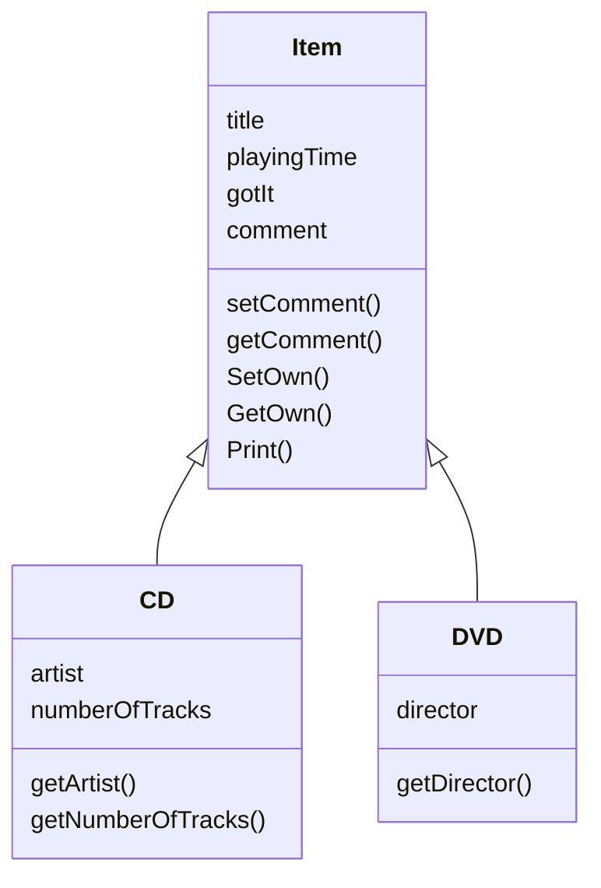

-   Define one superclass

-   Define subclasses

-   The superclass defines common attributes

-   The subclasses inherit the superclass attributes

-   The subclasses add their own attributes

```java
// Superclass
public class Item
{
    private String title;
    private int playingTime;
    private boolean gotIt;
    private String comment;

    // constructors and methods omitted.
}
// Subclass
public class CD extends Item
{
    private String artist;
    private int numberOfTracks;

    // constructors and methods omitted.
}
```



# Superclass constructor call

-   Subclass constructors must always contain a "super" call

-   If none is written, the compiler inserts one (without parameters)

-   Must be the first statement in the subclass constructor

```java
public class CD extends Item
{
    private String artist;
    private int numberOfTracks;

    /**
    * Constructor for objects of class CD
    */
    public CD(String theTitle, String theArtist, int tracks, int time)
    {
        super(theTitle, time);
        artist = theArtist;
        numberOfTracks = tracks;
    }

    // methods omitted
}
```

# Subclasses and subtyping

-   Classes define types

-   Subclasses define subtypes

-   Objects of subclasses can be used where objects of supertypes are
    used (this is called substitution)

# Polymorphic variables

-   Object variables in Java are polymorphic (they can hold objects of
    more than one type)

-   They can hold objects of the declared type, or of subtypes of the
    declared type

# Casting

-   Can assign subtype to supertype

-   Can’t assign supertype to subtype

For example, the last line of this causes a compile time error

```java
Vehicle v;
Car c = new Car();
v=c; // this is fine
c=v; // this causes a compile time error
```

This can be fixed with casting like so

```java
c= (Car) v;
```

-   An object type in parentheses

-   Used to overcome "type loss"

-   The object is not changed in any way

-   A runtime check is made to ensure the object really is of that type

# Polymorphic collections

-   All collections are polymorphic

-   The elements are of type object

# Collections and primitive types

All objects can be entered into collections because collections accept
elements of type Object and all classes are subtypes of Object

# Wrapper classes

-   Primitive types (int, char, etc) are not objects. They must be
    wrapped into an object

| Simple Type | Wrapper Class |
| ----------- | ------------- |
| int         | Integer       |
| float       | Float         |
| char        | Character     |

```java
int i=18;
Integer iwrap = new Integer(i); // wrapping the value
itn value = iwrap.intValue(); //unwrap it
```

# Static type and dynamic type

-   The declared type of a variable is its static type

-   The type of the object a variable refers to is its dynamic type

-   The compiler’s job is to check for static-type violations

# Overriding

-   Superclass and subclass define methods with the same signature

-   Each has access to the fields of its class

-   Superclass satisfies static type check

-   Subclass method is called at runtime - it overrides the superclass
    version

# Method lookup

-   The variable is accessed

-   The object stored in the variable is found

-   The class of the object is found

-   The class is searched for a method match

-   If no match is found, the superclass is searched

-   This is repeated until a match is found, or the class hierarchy is
    exhausted

-   Overriding methods take precedence

# Super call in methods

-   Overriden methods are hidden, but we often still want to be able to
    call them

-   An overriden method can be called from the method that overrides it

    -   `super.method(...)`

# Method polymorphism

-   Method calls are polymorphic - the actual method called depends on
    the dynamic object type

# The Object class’ methods

-   Methods in the objects are inherited by all classes

-   Any of those may be overriden

-   The `toString`java method is commonly overriden:

    -   `public String toString()`

    -   Returns a string representation of the object

    -   The programmer might want a custom representation of the data as
        a string

    -   Note that calls to `println` with just an object automatically
        result in toString being called

-   Equals can also be overridden if the manner in which two things
    equal each other is not the traditional definition

# Protected access

-   Private access in the superclass may be too restrictive for a
    subclass

-   The closer inheritance relationship is supported by protected access

-   Protected access is more restricted than public access

-   It is still recommended to keep fields provided and to define
    protected accessors and mutators


