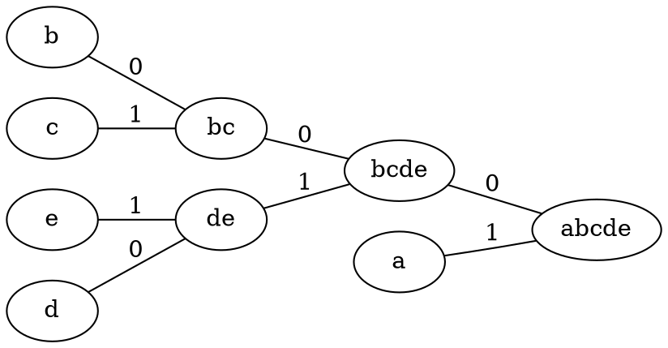

# Prefix Codes

## Memoryless sources

We model our data as coming from a memoryless source X. We imagine that symbols are emitted at random according to the probability distribution of X.

In other words, we view our data as a random string $X_1,X_2...$ over some alphabet $\mathscr{X}$. Our memoryless assumption is that those form a sequence of independent identically distributed (IID) random variables $X_i\sim X$ for all i

More concretely, for any $x\in\mathscr{X}$ and any i, the probability

$$
\mathbb{P}(X_i=x)
$$

is independent of i, and of all previous or future emitted symbols

<Important>

This is not always a valid assumption

</Important>

## The coding problem

We have a source emitting symbols in $\mathscr{X}=\{x_1,...,x_n\}$ with respective probabilities $\{p_1,...,p_n\}$

We want to encode the source symbols using code words as economically as possible. We have an alphabet of symbols $\mathscr{D}$

<Definition name="Source code">

A map $C:\mathscr{X}\rightarrow\mathscr{D}^*$ where $\mathscr{D}^*$ is the set of all finite strings of symbols in D

</Definition>

The words $C(x)$ are called the codewords, and the length of $C(x)$ is the word length.

We can extend the code to messages as follows. A message is any finite string of source symbols $m=m_1...m_k\in \mathscr{X}^*$ and it's encoding is the concatenation:

$$
C(m)=C(m_1)C(m_2)...C(m_k)
$$

## Prefix codes

<Definition name="Uniquely decodable">

A code C is uniquely decodable if every finite string in $\mathscr{D}^*$ is the image of at most 1 message

</Definition>

A prefix of a word $w-w_1...w_k\in \mathscr{D}^*$ is any word of the form $w_1...w_l$ for some $0\leqslant l \leqslant k$ (for l=0, we obtain the empty word)

<Definition name="Prefix">

A code is a prefix if there are no two distinct source symbols $x,y\in \mathscr{X}$ such that $C(x)$ is a prefix of $C(y)$

</Definition>

<Theorem>

A prefix code is uniquely decodable

</Theorem>

Let C be a prefix code, and let $w=C(m)$ for some message $m=m_1...m_k\in\mathscr{X}$. We give a decoding algorithm which, given w, determines m. Let $w=w_1...w_l$

Let $i$ be the smallest integer such that $w_1...w_i$ is a codeword, say $w_1...w_i=C(x)$. Then $m_1=x$.

If $m_1=y\neq x$ then $C(x)$ is a prefix of $C(y)$, which is a contradiction. Repeat this step, beginning with $w_{i+1}$ to determine $m_2$ and so on until $w$ is empty

<Example>

Let $\mathscr{X}=\{a,b,c,d,e\}, \mathscr{D}=\{0,1\}$ and

-   $C(a)=01$
-   $C(b)=100$
-   $C(c)=101$
-   $C(d)=1101$
-   $C(e)=1111$

Suppose we need to decode the word:

$$
C(m)= w = 10010111011111100101
$$

We read the word until we read a codeword

1. $w_1=1$
2. $w_1w_2=10$
3. $w_1w_2w_3=100=C(b)$

So $m_1$ is b, so we start again from the next character

1. $w_4=1$
2. $w_4w_5=10$
3. $w_4w_5w_6=101=C(c)$

So $m_2=c$ and so on

</Example>

# Huffman codes

## Compact codes

We want to design codes where the typical length of messages is reduced dramatically. The basic idea is to assign short codewords to more frequent symbols and longer codewords to less frequent ones.

Formally, the average length of the code is:

$$
L(C)=\mathbb{E}(|C(X)|)=\sum_{x \in \mathscr{X}}|C(x)| \mathbb{P}(X=x)
$$

<Definition name="Compact">

A code is compact if it is uniquely decodable and it minimises the average length of codewords over all uniquely decodable ones

</Definition>

<Theorem>

A uniquely decodable code with prescribed word length exists iff a prefix code with the same word lengths exists

</Theorem>

<Corollary>

For any source X, there is a compact prefix code for X

</Corollary>

## Binary Huffman code

The key is to construct a tree where the leaves correspond to symbols in $\mathscr{X}$ and the paths from the root to the leaves gives the codewords

The tree is constructed iteratively. Suppose $\mathscr{X}=\{x_1,...,x_n\}$ with $p_1\geqslant .... \geqslant p_n$

-   Merge $x_{n-1}$ and $x_n$ into a new symbol, say $x_{n-1,n}$ with probability $p_{n-1}+p_{n}$, and let $x_{n-1}$ and $x_n$ be the children of $x_{n-1,n}$ on the tree
-   Label the edges from $x_{n-1,n}$ to its children as 0 and 1, respectively
-   Repeat for the new source $X^{(1)}$, making sure to order the symbols in non-decreasing probability
-   Repeat until the final source $X^{(n-1)}$ only has one symbol left with probability 1, this is the root of the tree
-   Once the tree is built, read off the labels on the path from the root to a lead to get the corresponding codeword

<Example title="Non-binary huffman code">

Let X with respective probabilities

-   a = 0.4
-   b = 0.2
-   c = 0.15
-   d = 0.15
-   e = 0.1

The code is then

-   C(a)=1
-   C(b)=000
-   C(c)=001
-   C(d)=010
-   C(e)=011

</Example>

There is no need for tie-breaking rules. Different merges may yield different codes and maybe different code lengths, but always the **same expected length**

## Non-binary Huffman codes

Huffman codes can be extended to non-binary alphabets. For an alphabet of D characters, we group the D least likely symbols at each stage of reducing the source.

When expanding the code we append each of the D characters to one of the least likely symbol's codewords.

We must end up with exactly D symbols in the final source. So we may need to pad the original source up to $D+k(D+1)$ by adding symbols of probability 0
