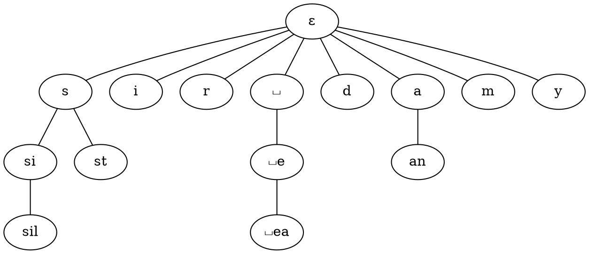

# LZ78

The LZ78 method does not use any search buffer, look-ahead buffer or sliding window. Instead it simply keeps a dictionary of previously encountered strings. The dictionary starts with the empty string at position zero and its side is only limited by the memory size.

The encoder outputs **two-field tokens** (instead of three-field tokens in LZ77). Each token simply corresponds to a new string in the dictionary: it is of the form

$$
(i,x)
$$

Where $i$ is the position of the longest match in the dictionary and $x$ is the final string

Nothing is every deleted from the dictionary

-   Advantage over LZ77 - future strings will be compressed even if they only match strings in the distant past
-   Drawback - the dictionary can become very large

<Example>

Say we want to compress

$$
sir\sqcup sid \sqcup eastman \sqcup easily \sqcup teases \sqcup sea \sqcup sick \sqcup seals
$$

| Dictionary Position | String     | Token        |
| ------------------- | ---------- | ------------ |
| 0                   | $\epsilon$ |              |
| 1                   | s          | (0,s)        |
| 2                   | i          | (0,i)        |
| 3                   | r          | (0,r)        |
| 4                   | $\sqcup$   | (0,$\sqcup$) |
| 5                   | si         | (1,i)        |
| 6                   | d          | (0,d)        |
| 7                   | $\sqcup e$ | (4,e)        |
| 8                   | a          | (0,a)        |
| 9                   | st         | (1,t)        |
| 10                  | m          | (0,m)        |
| 11                  | an         | (8,n)        |
| 12                  | $\sqcup$ea | (7,a)        |
| 13                  | sil        | (5,1)        |
| 14                  | y          | (0,y)        |

And so the compressed output is the list of tokens

$$
(0,s) (0,i) (0,r) (0,\sqcup) (1,i) (0,d) (4,e) (0,a) (1,t) (0,m) (8,n) (7,a) (5,l) (0,y)
$$

Once again, the decoder sees these tokens as instructions. But following these instructions means searching in the dictionary. A useful data structure for the dictionary is a tree, where the root is the empty string and a new string is added tto the tree as a child of the string it refers to on its token. Such a tree is called a **trie**

</Example>

# LZW

LZW is a variant of LZ78, with two main differences:

-   The dictionary is **initialised with all possible characters**. If we are compressing an ASCII file, then positions 0 to 255 are filled at initialisation
-   The tokens have only **one field**. Since we always work with at least one character, there is no need to output the next character

Working on the previous example

-   The first character in the string is s - appears in the dictionary
-   Next is si - doesn't appear in dictionary so add at position 256
-   Next is ir - doesn't appear in dictionary so add at position 257

Keep going like that to expand the dictionary

# Kolmogorov Complexity

The principal of LZ encoding is to construct a list of instructions to the decoder of the form

> Copy that string (and add that character)

But what if we allowed any sort of instructions?

The Kolmogorov complexity is a concept that predates LZ. It aims at evaluating the "instrinsic" complexity of a binary string. Basically, the Kolmogorov complexity of a string $x$ w.r.t a Turing machine U, denotes $K_U(x)$ is the shortest length of a program for U that prints out $x$ and halts

Obviously $K_U(x)$ is not computable, but still, we can say a lot about the Kolmogorov complexity of a random string: it's about the length of the string. Therefore almost any string is incompressible.
