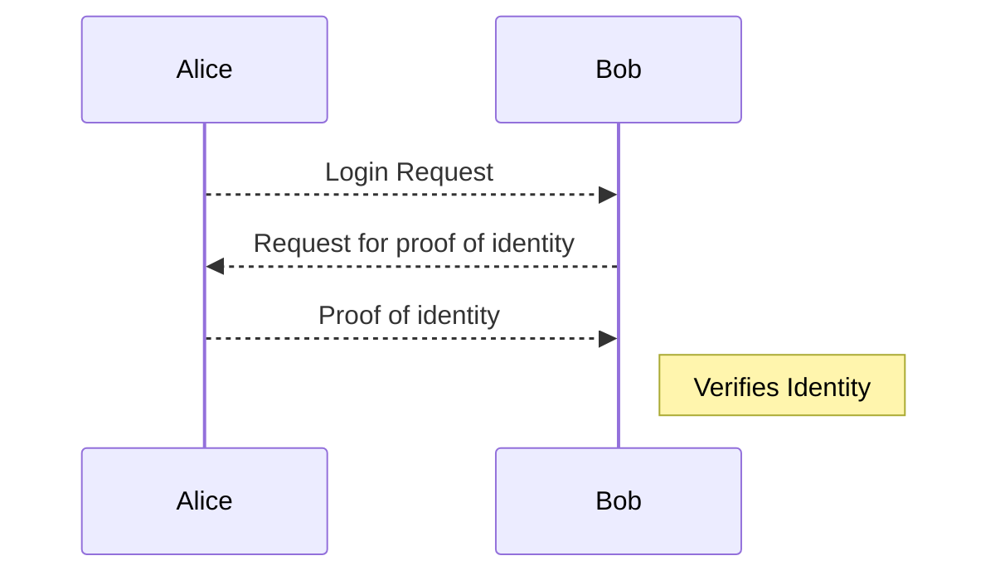

# RSA

Key Generation

1. Bob generates two prime numbers p and q and calculates n=pq
2. He also calculates $\phi=(p-1)(q-1)$
3. He then chooses a random e that is smaller than and relatively prime to $\phi$. The public key is (n,e)
4. He then calculates d such that de has remainder 1 when divided by $\phi$. The private key is (n,d)

Message passing:

1. Alice encrypts message m by calculating $c=m^e\mod n$
2. Alice transmits c
3. Bob decrypts the message by finding $m=c^d\mod n$

## RSA Complexity

-   The private key can be found using the public key if it is possible to find p and q given $n=pq$
-   So we are concerned with the following decision problem

<Problem name="Integer Factorisation" instance="Positive integers N and M, M<N" question="Does N have a factor d, $1\leqslant d \leqslant M$"/>

-   No polynomial algorithm is known for Integer Factorisation
-   Is is both **NP** and **coNP** (complement of problem in NP e.g. invert is it true to is it not true)
-   It is not NP-complete unless NP=coNP

# Generic Authentication scheme

## Authentication Schemes

-   The generic scheme has the obvious weakness that the proof of identity must be transmitted and that anyone who intercepts it can now imitate Alice
-   We want to find a scheme such that Alice identifies herself to Bob but no information is transmitted (i.e. Alice provides a **Zero Knowledge Proof** of Identity)

We will describe a scheme using Graph Isomorphism

# Zero knowledge proof for Graph Isomorphism

<Problem name="Graph Isomorphism" instance="Two undirected graphs $G=(V_G,E_G)$ and $H=(V_H,E_H)$" question="Are G and H isomorphic, i.e., is there a bijection $f:V_G\rightarrow V_H$ such that $(u,v)\in E_G$ iff $(f(u),f(v))\in E_H$"/>

Alice publishes two isomorphic graphs $G_1$ and $G_2$ for which she knows an isomorphism $\sigma$

Repeat the following:

-   Alice chooses a permutation $\pi$ of the vertex set of $G_1$ and computes the graph H obtained from $G_1$ by applying $\pi$
-   Alice sends H to Bob
-   Bob sends i to Alice where $i\in\{1,2\}$
-   Alice computes a permutation $\rho$ such that H is obtained from $G_i$ by permuting the vertices according to $\rho$
-   Alice sends $\rho$ to Bob
-   Bob checks that $G_i$ can be obtained from H using $\rho$. Bob accepts Alice is $\rho$ is correct for every repetition.

> The strength comes in here that $\pi$ is easy to apply, but difficult to work backwards to get, just like with RSA

## Properties of zero knowledge proofs

-   **Completeness**

    If alice knows the proof then Bob must accept

-   **Soundness**

    If Alice doesn't know the proof then Bob must reject with high probability

-   **Zero knowledge**

    No information about the proof should be transmitted

# Zero Knowledge Proof for 3-Colouring

Zero Knowledge proofs can be found for any problem in NP

Alice publishes a graph H for which she knows a 3-colouring c

Repeat the following:

-   Alive permutes the colour in c before colouring G. She covers up the coloured vertices
-   Bob picks a pair of adjacent vertices u and v
-   Alice uncovers u and v to reveal their colours

Bob accepts Alice if u and v have distinct colours in every repetition

# Bit commitment

-   For each vertex x, alice creates two keys: public $(n_x,e_x)$ and private $(n_x,d_x)$
-   Alice encodes the colour of each vertex with public key and sends the encoded colours to Bob
-   Bob chooses an edge (u,v) and sends it to Alice
-   Alice sends the private keys for u and v to Bob
-   Bob verifies that they are indeed the right keys and decodes the colours of u and v.
