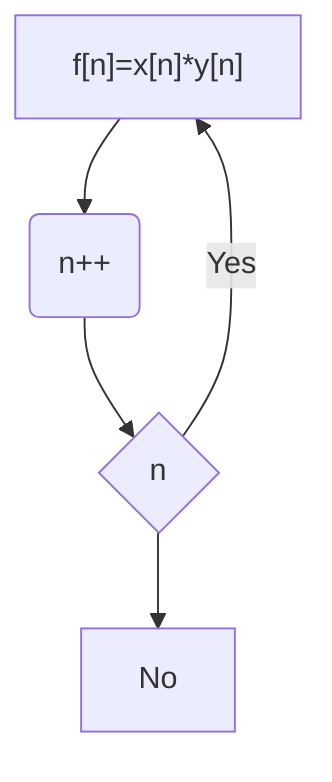
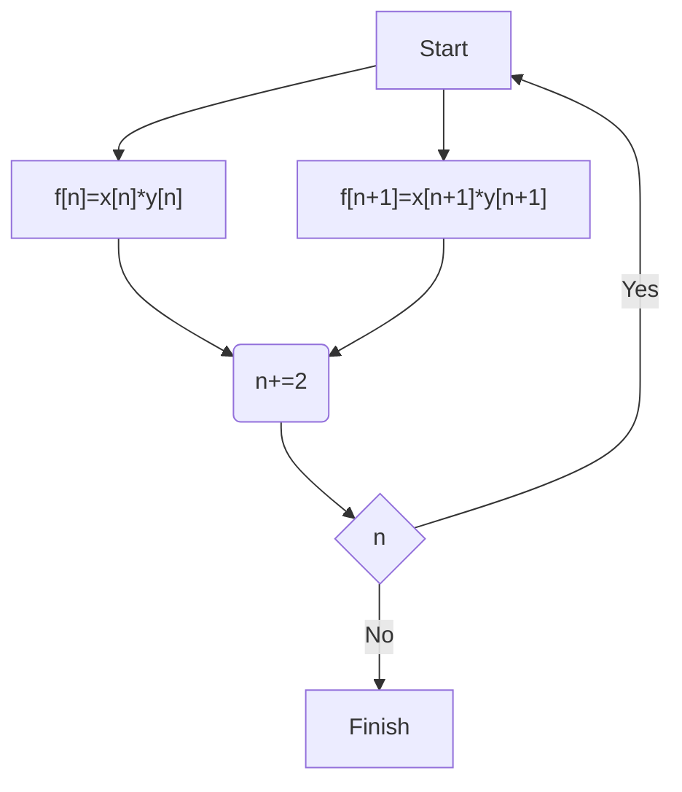

<Definition name="Vector Operation">

An operation which runs the same operation on multiple pieces of data in one go

</Definition>

<Definition name="SIMD">

Single instruction multiple data - Equipping chips with vector computing capabilities

</Definition>

# Code snippets

Single assignment form is where there is one variable at the left of each step, so they all have the form:

$$
a \leftarrow a\circ b
$$

Each step is now a node in a graph, where two nodes are connected via a directed edge if the computer might run one instruction after the other

<Example>

The graph of the vector addition

$$
f=x+y, f,x,y \in \mathbb{R}^{10}
$$

corresponds to the code

```c
for (int n=0; n<N; n++){
    f[n]=x[n]+y[n]
}
```

equals:



</Example>

<Definition name="Control flow Graph">

A representation of a particular code representation of out algorithm, consisting of elementary steps and possible successors

</Definition>

It isn't required to have single assignment form to extract a control flow graph, but it does make it easier.

We can rearrange such that vector operations happen using the following transformation pattern

1. Copy the body within the loop once
2. Within the loop body, rearrange the operations such that two operations using the same binary operation but working on different data follow immediately after each other
3. Fuse the pairs of of operations with the same operator into one vector operation

<Example title="Continued">

Continuing on from the previous example, we can obtain the following code

```c
for (int n=0; n<N; n+=2){
    f[n]=x[n]+y[n];
    f[n+1]=x[n+1]+y[n+1]
}
```

which corresponds to the process control graph



</Example>

<Definition name="Loop Unrolling">

Loop unrolling by a factor of b is a technique to generate code exploiting b-fold vector units

</Definition>

Vector operations in our (unrolled) loop body have to look like

-   They have to group exactly the same operation together
-   Each operand has to have the same type
-   The results have to go into separate memory locations

<Definition name="Reduction">

A function $f(x_0,x_1,...)=x_0\circ f(x_1,...)$, reducing a vector to a scalar

</Definition>

Properties we need our loop to consider

1. **Countable**

    We need to know how many iterations will be performed when we look at the loop, so suitable for `for`, less so for `while`

2. **Well-formed**

    No `break` or `continue` statements

3. **Branching/simplicity**

    Shouldn't have:

    - `if` statements
    - Nested loops
    - Function calls

4. **Cost**

    Chips will reduce clockspeed when they encounter vector operations. The performance benefit is worth it, but only if you do it right

# Hardware realisation flavours

## Large vector registers

This method involves working with large vector registers that can host N values and once, when we add two of these massive registers, they effectively perform N additions all in one go.

If one vector register holds two entries and we combine their 1st and 2nd entry, this is a **horizontal vector operation**. If entries from multiple registers are combined with each other, we call this a **vertical vector operation**.

Modern vector units offer **fused multiply add**, which allows for computing

$$
f=x+(y\cdot z)
$$

in one step

## Lockstepping

<Definition name="Lockstepping">

Where multiple ALUs do exactly the same thing at the same time

</Definition>

This is particularly common in GPUs where there are thousands of cores (and so thousands of ALUs)

One GPGPUs SIMD programming is also called **Single Instruction Multiple Threads (SIMT)**

## Branching

Branching helps with evaluating code like:

```c
for (int n=0; n<N; n++) {
    if (x[n]>0.0) {
        f[n] = x[n] * y[n];
    }else {
        f[n] = -x[n] * y[n];
    }
}
```

<Definition name="Masking">

A condition is evaluated and its outcome is stored in a register. Then a SIMD computation is completed, but the result is discarded for those vector elements for which the maskings register isn't set

</Definition>

<Definition name="Divergence">

If k threads compute the same in lockstepping but some of the results will be masked

</Definition>

Masking allows us to vectorise over code snippets with if statements, but can lead to code that wastes energy and is slower than its scalar counterpart.

<Definition name="Blending">

Where a code consists of two branches which are evaluated simultaneously, but only one outcome is used

</Definition>

<Definition name="Gather">

Where we grab various entries from different places in memory into one large vector register. The inverse of this is called **scatter**

</Definition>

When multiplying matrices, access will suffer from scattered memory access as it is either stored row by row or column by column.

<Definition name="Tensor Units">

Dedicated hardware to compute $F=X+(Y\cdot Z)$ and variations of these where the variables are matrices

</Definition>
